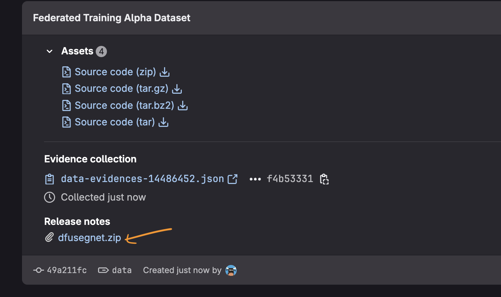

## How to run

### Data
- Download data from [here](https://gitlab.com/symptomtraceengineering/data-scientist/diabetic-foot-wound-lab/-/releases/data)



- Unzip the file above, place it at your desired path `<path-to>/dfusegnet`
- Reflect in `data.yaml`
  Example: Placing data at `/home/chiawei/data/dfusegnet`
  the cols.yaml will be 
  ```
  portland,/home/chiawei/data/dfusegnet
  seattle,/home/chiawei/data/dfusegnet
  ```

### File Dependencies
- Git clone this repo, copy `<path-to>/federated_training` in all server to train the model 

### Python Dependencies
- Activate the pipenv/conda environment

- Install based on requirements.txt
  `pip install -r requirements.txt`
- Install in-house library for openfl
```
git clone git@gitlab.com:symptomtraceengineering/data-scientist/openfl.git
cd openfl
git checkout apidev
python setup.py develop
```
- Install in-house library for foot wound algorithm
```
git clone git@gitlab.com:symptomtraceengineering/mlops.git

cd mlops/woundlib/woundlib
python setup.py develop
```


## How to run

- In each node, following execute under `<path-to>/federated_training`

### Aggregator
```
fx plan initialize --aggregator_address ms.agg01.symptomsquirrel.com (only for the first time)

fx aggregator start
```

### Collaborator 1 (Portland)
```
fx collaborator start -n portland
```

### Collaborator 2 (Seattle)

```
fx collaborator start -n seattle
```

## Error

### Error 1
```
ImportError: libGL.so.1: cannot open shared object file: No such file or directory
```

### Solution
```
sudo apt-get update && sudo apt-get install ffmpeg libsm6 libxext6  -y
```

### Error 2
```
Install woundlib
```

### Solution 

```
git clone git@gitlab.com:symptomtraceengineering/mlops.git
cd <path-to>/mlops
git checkout dfu-dev
cd src/woundlib/woundlib
python setup.py develop
```